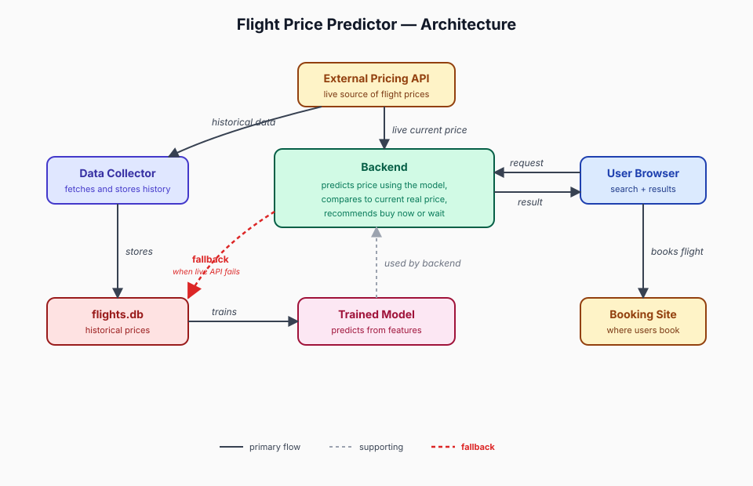

# Flight Price Predictor

A machine learning project that predicts what a flight should cost. It has three parts: a data pipeline that has collected real airfares every day since May 2026, a trained price model with an honestly measured error rate, and a web frontend.

**Live frontend:** https://flight-price-predictor-eosin.vercel.app/ — design preview with sample predictions; the model-serving backend is in progress.

**The numbers:**
- **401,825** flight offers collected, growing by ~4,000 per day
- **200+ routes** across 55+ airports in North America, Europe, and Asia
- Model predictions land within **14.6%** of the actual price on average, measured on flights the model never saw during training




---

## Status

| Component | Status |
|---|---|
| Data pipeline (runs daily, unattended) | Running since May 2026 |
| Data-quality checks (duplicate removal + daily audit) | Complete |
| Exploratory data analysis (2 phases, ~18 documented plots) | Complete |
| Feature engineering | Complete |
| Baseline model (linear regression) | Complete — 17.1% average error |
| XGBoost model | Trained — 14.6% average error |
| Deployable model export | Complete |
| Frontend ([live on Vercel](https://flight-price-predictor-eosin.vercel.app/)) | Design preview live |
| Prediction API (model backend) | In progress |

---

## Tech Stack

- **Pipeline:** Python, SQLite, `requests`
- **Processing:** Pandas, NumPy
- **Modeling:** Scikit-learn, XGBoost
- **Visualization:** Matplotlib, Seaborn
- **Notebooks:** Jupyter
- **Frontend:** Hand-written HTML/CSS/JS with a WebGL night-sky background, hosted on Vercel

---

## Project Structure

```
flight-price-predictor/
├── data_collector/                # Daily ingestion pipeline
│   ├── collect.py                 # Main collector — calls the API, writes to SQLite
│   ├── dedupe.py                  # Duplicate guard (9-column exact key)
│   ├── audit.py                   # Daily NULL/range/volume audit
│   ├── routes.py                  # 200+ origin-destination pairs to query
│   ├── schema.sql                 # Database schema
│   ├── populate_airports.py       # Airport reference table loader
│   └── populate_airlines.py       # Airline reference table loader
├── notebooks/                     # EDA notebooks (4)
├── src/                           # Feature engineering and modeling
│   ├── features.py                # Feature building — shared by training and serving
│   ├── split.py                   # Train/validation/test split
│   ├── train_lr.py                # Linear regression baseline
│   ├── train_xgb.py               # XGBoost training run
│   ├── metrics.py                 # Error measurement with confidence intervals
│   └── build_deploy_model.py      # Exports the trained model for deployment
├── frontend/                      # The live site (single self-contained page)
├── documentation/                 # Design notes, experiment log, daily run logs
├── data/                          # SQLite DB (gitignored)
└── requirements.txt
```

---

## Data Pipeline

The pipeline runs daily on a schedule (macOS launchd), pulling round-trip flight offers from a commercial pricing API into a local SQLite database. One row per offer. It has run unattended since early May 2026, including through slow-API days, and has accumulated **400,000+ offers**.

**What it does each day:**
- ~3,200 API calls per run (200+ routes × 7 departure months × 2 trip lengths)
- ~4,000 offers inserted per day
- Retries failed calls up to 3 times with increasing wait times — multiple slow-API days handled with zero final failures
- Logs every run to a `runs_logs` table (start/finish, calls, inserts, failures)
- Backs up the database to a cloud folder

**After each run, two quality checks** (`dedupe.py`, `audit.py`):
- Removes exact duplicate rows
- Flags missing values in columns the model depends on
- Flags impossible values (negative prices, trip durations over a year)
- Detects volume drops — a day with unusually few rows usually means a silent collection problem
- Exits with an error code on any anomaly so the scheduler's log captures the alert

**To run the collector:**

```bash
pip install -r requirements.txt

# In data_collector/.env, set:
#   API_TOKEN=<your token>
#   API_URL=<your endpoint>
#   BACKUP_PATH=<optional cloud-synced path>

python data_collector/collect.py
```

---

## What the Data Showed (EDA)

~18 documented plots across two phases. The findings that shaped the model:

- Fares are heavily skewed — a few very expensive tickets distort averages, so the model predicts the *logarithm* of price and converts back to dollars
- Distance is the strongest single predictor, but doubling distance doesn't double price
- Budget and legacy airlines form two distinct price regimes on short routes
- Day of week matters for international trips (weekend premium), barely at all for domestic
- Nonstop flights carry a real premium regardless of distance
- Booking earlier matters mainly for long-haul trips
- A key surprise: the same flight's price barely moves day to day — most price variation comes from *which* flights are on offer, not from prices changing. This shaped the whole product: predict what a trip should cost, rather than trying to time price movements

---

## The Model

**What it predicts:** the typical price of a route on a date — using only the information a traveler actually has when searching (origin, destination, dates). Details you'd only know *after* seeing an offer, like the airline or number of stops, are deliberately excluded, so the model works as a real product rather than just scoring well in a notebook.

**Results, measured on flights held out from training:**

| Model | Average error |
|---|---|
| Linear regression (baseline) | 17.1% |
| XGBoost | **14.6%** |

**How the numbers are kept honest:**
- The model is scored on whole trips it never saw during training — no partial overlap
- Every result carries a confidence interval, so a small "improvement" that's really just noise doesn't get counted
- Every experiment is logged in [`documentation/modeling_runs.md`](documentation/modeling_runs.md) with its exact code version, one change at a time
- A final test set stays untouched until the very end — it will be used exactly once, on the finished model

**Known limits, stated plainly:** predictions for departure dates far beyond what the model has seen are less reliable, and the frontend shows every prediction as a range rather than a single number for exactly that reason.

---

## Deployment

The trained model exports to a small bundle of plain files (the model itself, route statistics, reference tables, and a metadata file recording exactly which code and data produced it). No pickled Python objects — the bundle can be loaded by a lightweight server without the training environment installed.

The live site is currently a design preview with sample predictions. Next step: a small prediction API that loads the bundle and answers route-plus-date queries, which the frontend will call for real predictions.

---

## Dataset

The SQLite database is gitignored (~600MB and growing). The collector rebuilds it from scratch given an API key, though the dataset's depth — months of daily snapshots — accumulates at ~4,000 rows per day and can't be shortcut.
