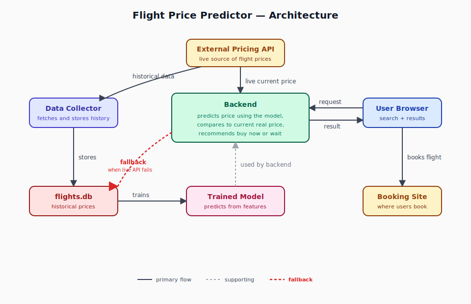

# Architecture

System diagram for the flight price predictor. Three independent flows share one database and one trained model.

The diagram lives in [`architecture.svg`](architecture.svg) — a hand-coded SVG. Edit the XML directly to tweak boxes, labels, or arrows. Renders natively in browsers, GitHub, and any markdown viewer.

---

## What the diagram captures

- **Two purposes for the External Pricing API:** `historical data` for the collector to store, and `live current price` for the backend to compare against during a user request.
- **The flights.db is a fallback for the backend.** If the live API call fails when serving a user request, the backend reads the most recent stored price from the database and serves that with a stale-price warning. This is the red dashed arrow — the most important supporting flow to remember.
- **The model is trained from historical data,** not from each user request. Training happens separately; the backend just uses the trained model.
- **Features come from the user's input,** not from the database. The backend builds them on the fly when a request comes in.
- **The booking site is the predict→book closing point.** A user lands there from the "Book Now" link in the result — that's how the loop completes.

---

## Component reference

### Database (`flights.db`)
SQLite file on the same server as the backend. Holds the `offers` table: every flight offer ever collected, with `captured_at` distinguishing daily snapshots of the same flight. Indexed on `(origin, destination, departure_at)` and `captured_at`. Single-writer (only `collect.py` writes); many-reader (training reads everything; backend reads only as fallback).

### Model file (`model.pkl`)
Serialized trained predictor (probably XGBoost or RandomForest). Loaded once into the backend's memory at app startup. Re-fit weekly by `train.py`; old versions kept (`model_2026-09-01.pkl` etc.) so you can roll back.

### Frontend (user browser)
Static HTML/JS. Presents a search form (origin, destination, departure date), sends a request to the backend, renders the JSON response as a recommendation + price + "Book Now" button. Doesn't talk to the partner API directly — only to the backend.

### Backend (your server app)
Single Python program built on Flask or FastAPI. Loads `model.pkl` at startup. For each user request:
1. Validates input (real airport codes, future dates)
2. Builds features from user input
3. Calls `model.predict(features)` → predicted price
4. Fetches live current price from partner API (cached briefly)
5. Compares predicted vs current → recommendation
6. Returns JSON

Never writes to the database. Reads only as fallback.

### Live-fetch cache
In-memory dict (or `cachetools.TTLCache`) inside the backend process. Keyed by `(origin, destination, departure)`. TTL ~5-15 minutes. Multiple concurrent users searching the same route share one API call. v1 — single-process cache is fine. v2 — Redis if you scale to multiple workers.

### Partner pricing API
External HTTPS endpoint owned by the partner. Used by both `collect.py` (daily, batch) and the backend (live, on demand). The backend's live call uses the same endpoint — same data source, different trigger.

### Partner booking site
Where users land after clicking the booking link in the response. Out of scope for the system you build — it's the external destination that closes the predict→book loop.

### `collect.py` (scheduled daily)
Triggered by `launchd` each morning. Loops over all routes × all lead times, calls partner API, inserts each returned offer into `flights.db`. ~7-15 minutes per run for ~120 routes × 6 lead times.

### `train.py` (scheduled weekly)
Triggered by `launchd` each Sunday. Reads all rows from `flights.db`, builds features, fits the model, saves `model.pkl` (with version suffix). When the backend restarts, it picks up the new model.

---

## Data sources at a glance

| What the system needs | Where it gets it |
|---|---|
| Current price (right-now) | Live API call (cached) |
| Current price (fallback) | Most recent row in `flights.db` |
| Booking link | Live API response (or stored offer fallback) |
| Predicted price | `model.predict(features)` |
| Features | Built from user input alone |
| Training data | `flights.db` (read by `train.py`) |
| Model file | `model.pkl` (loaded into backend memory at startup) |
| Confidence / coverage signal | Optional `flights.db` lookup ("we have 90 days of data for this route") |
